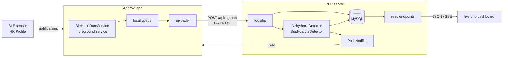

# Developer notes

What the pieces are, how a heartbeat gets from a chest strap to a chart, and the things that will surprise you.

## Shape



The app is the only writer. Everything else reads.

## The two halves

**`app/`** is a single-module Android app. Kotlin, Compose, one activity, Compose navigation. Ktor is the HTTP client. A foreground service owns the BLE connection, because Android will otherwise kill it the moment the screen goes off; `util/OemCompatibilityHelper.kt` exists because "foreground service" means different things to Xiaomi, Samsung, Oppo and everyone else, and the app has to tell the user which settings screen to go and fix.

**`server/`** is plain PHP, no framework and no autoloader. `config.php` is the shared bottom of every file: environment loading, the PDO connection, the JSON response helper, the device profile table, and the access gates. `api/*.php` are one endpoint per file. `live.php` is the dashboard, and it is one 4,000-line file containing its own HTML, CSS, JavaScript, translations and SQL.

## Data flow, concretely

1. The sensor sends a Heart Rate Measurement notification, roughly once a second, carrying BPM, optional RR intervals and a contact flag.
2. The service queues it locally and posts it to `api/log.php` with the API key.
3. `log.php` validates the key, checks the MAC against `HR_ALLOWED_DEVICES`, inserts into `heart_rate_logs`, then runs the detectors.
4. `ArrhythmiaDetector` looks at a rolling window of RR intervals: RMSSD and pNN50 for atrial fibrillation, rate thresholds for tachycardia and bradycardia, and jump patterns for ectopic beats. It writes to `arrhythmia_events` with a confidence score. `BradycardiaDetector` keeps a single open episode per device in `bradycardia_episodes` and closes it when the rate recovers.
5. The dashboard polls the JSON endpoints and subscribes to `api/sse-all.php` for live updates.

## Things that will surprise you

### There is one credential and it does two jobs

`HR_API_KEY` is the shared secret with the app *and* the dashboard password. There is one user, so a second credential would have been one more thing to lose. `hasValidApiKey()` reads the `X-API-Key` header only and compares with `hash_equals`, not `!==`, because string comparison returns at the first differing byte and how long that takes is a measurement of how much of the key the caller guessed.

`requireReadAccess()` admits either the key or a dashboard session. `validateApiKey()` demands the key outright, and `history.php` and `alerts.php` use it, which means a browser session cannot reach those two. Nothing in the dashboard calls them today. If you wire one up, that is why it 401s.

`HR_PUBLIC_READ=1` turns the gate off entirely. It exists so the old behaviour is a deliberate setting rather than an accident.

### The dashboard finds its own API path

`API_BASE` is derived from `window.location.pathname`. Every fetch used to name an absolute path containing the one directory the author deployed to. Anywhere else, the page still rendered perfectly - and every fetch 404'd, so the charts were empty, the episode list never loaded and the connection badge sat on "Disconnected" with a reading one second old in the database. It looked like a data problem and it was a path problem.

Keep new fetches relative to `API_BASE`. `ops/hygiene.sh` fails the build if an absolute path comes back.

### `textContent` does not parse markup

The pause button assigned SVG source to `textContent`, which renders it as visible text. The button worked until you pressed it, then displayed raw `<svg ...>`. It is `innerHTML` with two icon constants now. The same tripwire watches for this.

### Two Java versions, provisioned separately

`jvmToolchain(17)` in `app/build.gradle.kts` sets the Java the *project* compiles with, and the foojay resolver in `settings.gradle.kts` lets Gradle download it. That is not the same as the JVM the Gradle *daemon* runs on, which comes from your `JAVA_HOME` and has to be 17 or newer because AGP 8.7 requires it. This project has no `gradle-daemon-jvm.properties`, so `./gradlew` on a Java 8 launcher fails while resolving the Android plugin, before the toolchain is ever consulted.

What used to be here was `org.gradle.java.home` pointing at `/usr/lib/jvm/java-17-openjdk-amd64`, which made the build start on exactly one machine.

### Firebase is optional and the config is gitignored

The Google Services plugin fails the build outright when `google-services.json` is missing, and that file is gitignored, so a fresh clone could not build at all. The plugin is applied only when the file exists, and `HeartMonitorApp.enableCrashReporting()` checks `FirebaseApp.getApps()` before touching Crashlytics - without that check, `getInstance()` throws from `onCreate` and the app dies on launch.

### Device profiles are a table, not a tree of ifs

`DEVICE_PROFILES` in `config.php` maps a MAC prefix to a type, display name, short label and an "artifact HR" - a fixed bogus reading some straps emit on connection loss, which `getArtifactFilter()` turns into a SQL exclusion. Add a device by adding a row. Note that the dashboard still has a branch for a `pvs` device type that no profile defines; it is dead and harmless.

### The time zone lives in one line

`config.php` calls `date_default_timezone_set('Asia/Kolkata')` while MySQL uses the server's own zone. They agree on the author's machine. If yours disagree, timestamps written by MySQL `NOW()` and formatted by PHP will drift by the offset, and short chart windows will look empty while long ones look fine.

## Running it locally

You need PHP and a MySQL or MariaDB you can create a database in.

```bash
mysql -u root -p < server/schema.sql
cd server
cp .env.example .env     # set HR_API_KEY, HR_ALLOWED_DEVICES, and HR_DB_PORT if not 3306
php -S 127.0.0.1:8099
```

Then `http://127.0.0.1:8099/live.php` and sign in with the API key. With no rows in `heart_rate_logs` the page renders empty, which is correct but tells you nothing; insert a few hundred synthetic readings if you want to see the charts work.

`HR_DB_PORT` is worth knowing about: the DSN used to hardcode 3306, so a database on any other port needed a source edit.

## Checks

```bash
server/tests/http-gate-test.sh   # the access gate, over real HTTP, 21 assertions
ops/hygiene.sh                   # tripwires for defects this repo has had
./gradlew assembleDebug lint     # needs JDK 17+ and the Android SDK
```

CI runs all three on push and pull request. The gate test runs against a real MySQL service container with the schema loaded, not a mock, because the thing being tested is what an HTTP request gets back.

There are no Android unit tests. Almost every class here touches the Android framework - BLE callbacks, a foreground service, DataStore, Compose - and the pure logic that would be worth testing lives in the PHP detectors instead. That is a real gap, not a claim that it is fine.
