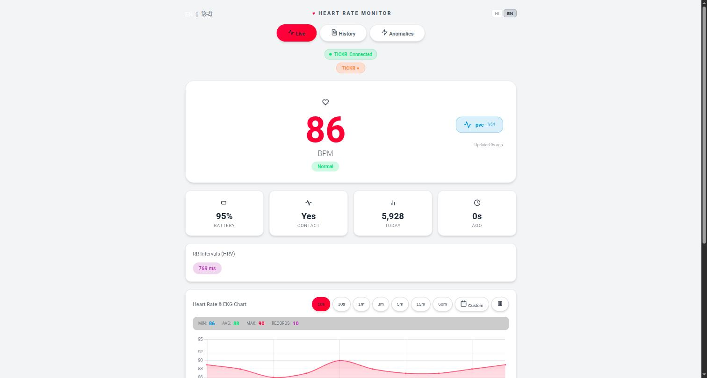
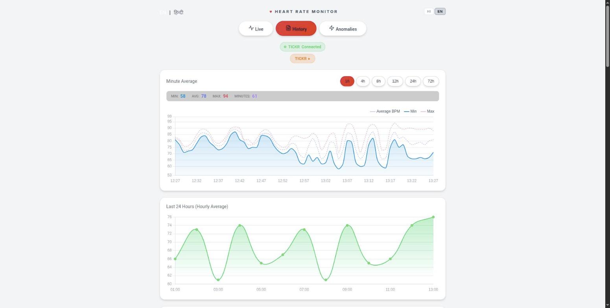
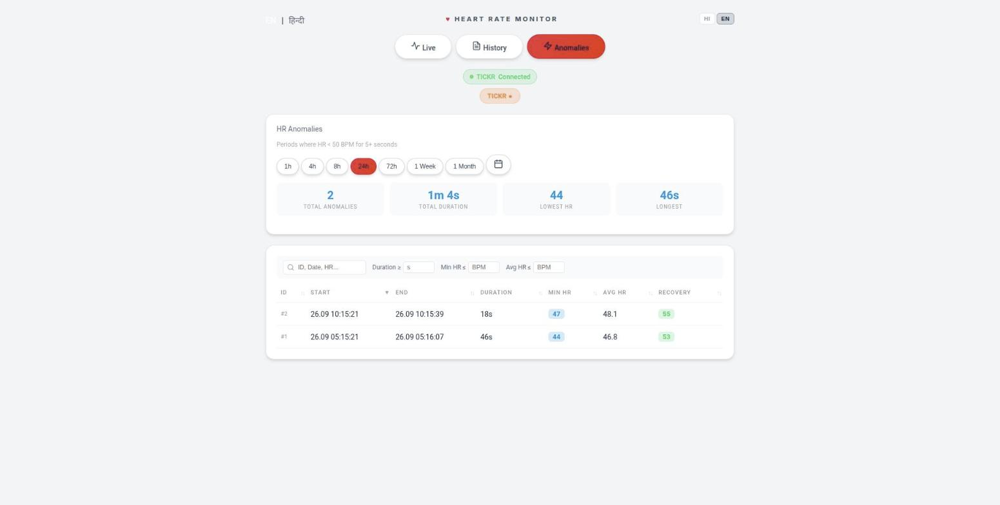
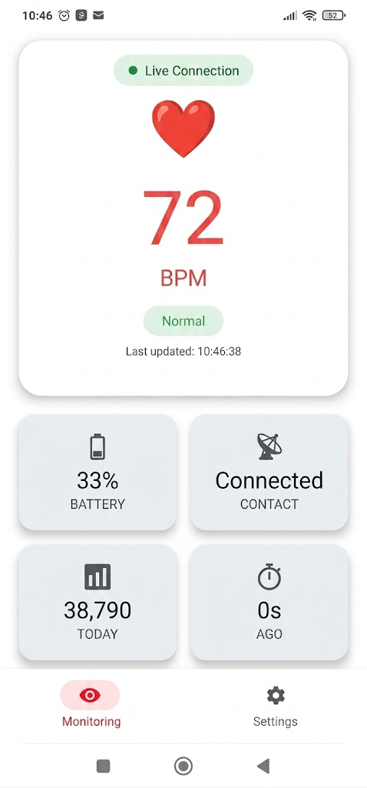
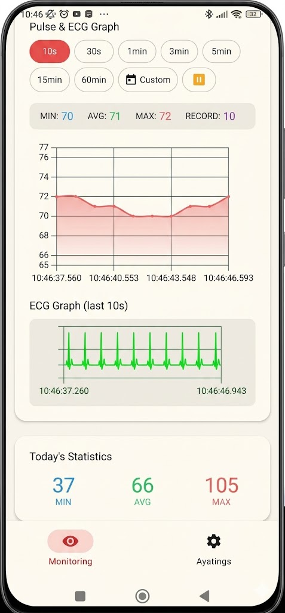
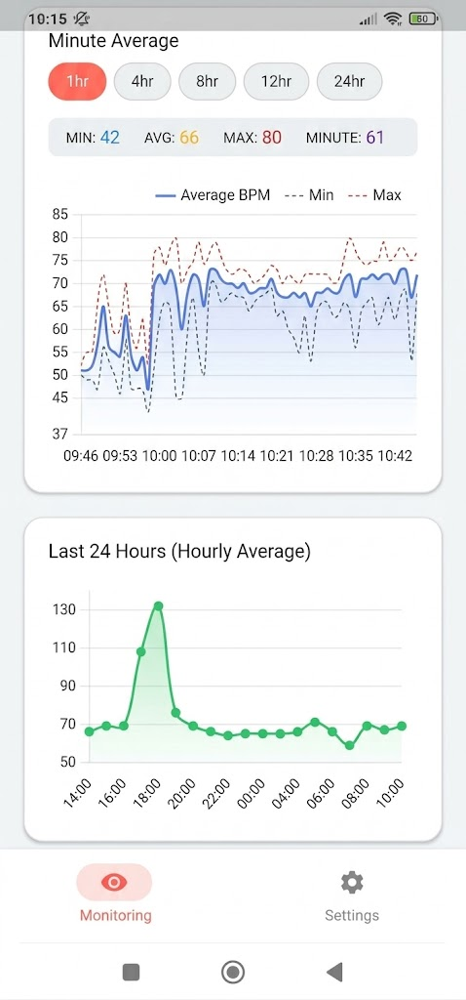
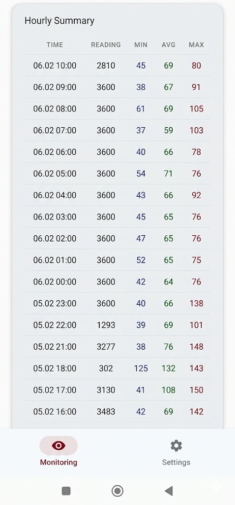
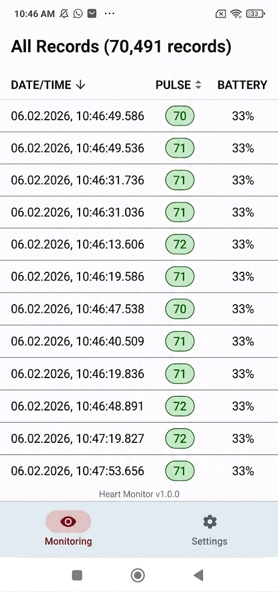
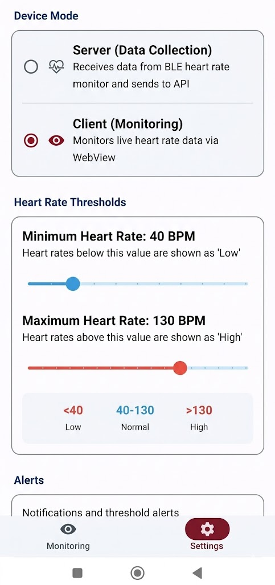

> **Language:** **English** | [Hindi (हिंदी)](README_HI.md)

<div align="center">

<picture>
  <source media="(prefers-color-scheme: dark)" srcset="./docs/assets/adk_dev_logo_light.png">
  
</picture>

# Real-Time Heart Rate Monitor

**A BLE heart rate monitor: an Android app that reads the sensor in a foreground service, and a PHP dashboard that shows the readings live.**


<br>


<br>


<br><br>

**[Developer documentation](./DEVDOC.md)** &middot; [The dashboard](#the-dashboard) &middot; [The app](#the-app) &middot; [Features](#features) &middot; [Setup](#setup)

</div>

---

## Overview

An Android app reads heart rate from a Bluetooth Low Energy chest strap or armband (Polar, Garmin, Wahoo TICKR and anything else speaking the standard BLE Heart Rate Profile) and posts each reading to a PHP server. The server stores the history, detects arrhythmia and bradycardia episodes, and serves a live web dashboard.

> [!IMPORTANT]
> The read endpoints and the dashboard now require a credential. Earlier versions served live and historical heart rate to anyone who knew the URL. See [Access control](#access-control).

---

## The dashboard

| Live | History | Anomalies |
|:---:|:---:|:---:|
|  |  |  |

Live heart rate with RR intervals, per-minute and hourly aggregates over any window from one hour to a month, and a sortable, filterable log of every detected episode. English and Hindi.

## The app

| Live Monitoring | Analytics and Stats | Hourly Trends |
|:---:|:---:|:---:|
|  |  |  |

| Summary | Record Logs | Device Configuration |
|:---:|:---:|:---:|
|  |  |  |

---

## Features

### Acquisition
- Standard BLE Heart Rate Profile, so most straps work without configuration.
- Automatic reconnection, battery level, and skin-contact reporting.
- Beat-to-beat RR intervals, not just the averaged BPM.

### Analysis
- Live heart rate and an RR-derived interval chart.
- Daily minimum, average and maximum, plus per-minute and hourly aggregation.
- Arrhythmia detection (atrial fibrillation, tachycardia, bradycardia, PVC, PAC, SVT) with a confidence score, and bradycardia episodes tracked from onset to recovery.
- HRV-based signal quality, used to discard sensor artifacts.

### Server
- JSON endpoints for the app to write to and the dashboard to read from.
- Server-Sent Events for live updates without polling.
- The app caches locally and syncs when connectivity returns.

### Alerts and modes
- Threshold alerts with sound and vibration.
- Server mode (this device wears the sensor) or client mode (this device only watches).
- A foreground service with per-manufacturer battery-optimisation guidance, because staying alive in the background is where these apps usually die.

---

## Requirements

**App:** Android 8.0 (API 26) or newer, BLE hardware, and the Bluetooth, location (Android requires it for BLE scanning) and notification permissions.

**Server:** PHP 8.1 or newer, MySQL 8.0 / MariaDB 10.6 or newer, Apache or nginx.

---

## Setup

### 1. The server

```bash
git clone https://github.com/Dileepadari/RT-HRM.git
cd RT-HRM
cp -r server/ /var/www/html/hr/
mysql -u root -p < server/schema.sql
```

Then configure it:

```bash
cd /var/www/html/hr/
cp .env.example .env
$EDITOR .env
```

`HR_API_KEY` is the shared secret between the app and the server, and it is also the dashboard password. Set it to something you would not mind being the only thing between a stranger and a record of your heartbeat. `HR_ALLOWED_DEVICES` is a comma-separated list of the sensor MAC addresses you want accepted.

The dashboard lives at `live.php` under wherever you put the folder, and finds its own API path from there, so `/hr/`, `/monitoring/hr2/` and a domain root all work without editing anything.

### 2. The app

Build it:

```bash
./gradlew assembleDebug
```

You need a JDK 17 or newer to run Gradle. The project's Java version is declared as a toolchain, so Gradle will resolve or download the compiler it needs.

Crash reporting is optional. Drop your own `google-services.json` into `app/` and Firebase Crashlytics is applied automatically; without it the app builds and runs with crash reporting switched off.

Then open **Settings** in the app, set the **API URL** (`https://your-server/hr/api/log.php`) and the same **API Key**, choose server or client mode, and connect your sensor.

---

## Access control

Every read endpoint and the dashboard require one of:

- the API key in an `X-API-Key` header, which is what the app sends, or
- a dashboard session, which you get by entering the API key at `live.php`.

The key is accepted in the header only. It used to be read from the query string as well, which put it into the web server's access log, into any `Referer` sent to a third party, and into the browser history of anyone who opened the URL.

To go back to open access, set `HR_PUBLIC_READ=1`. Be aware of what that publishes: a continuous record of one identifiable person's heart rate, their arrhythmia episodes, and by implication when they are asleep, exercising or not at home.

`server/tests/http-gate-test.sh` asserts all of this over real HTTP, and CI runs it on every push.

---

## API

### Writing (app to server)

```http
POST /api/log.php
Content-Type: application/json
X-API-Key: {YOUR_API_KEY}

{
  "device_mac": "XX:XX:XX:XX:XX:XX",
  "heart_rate": 72,
  "rr_intervals": [850, 862, 845],
  "battery_level": 85,
  "sensor_contact": true,
  "timestamp": 1699876543210
}
```

### Reading

| Endpoint | Returns |
|----------|---------|
| `/api/latest.php` | The most recent reading. |
| `/api/latest-all.php` | The most recent reading per device. |
| `/api/chart-data.php?seconds=60` | Plot points for the last N seconds. |
| `/api/minute-summary.php?hours=1` | Per-minute min, average and max over N hours. |
| `/api/today-count.php` | Today's reading count with min, average and max. |
| `/api/arrhythmia.php?hours=24` | Detected arrhythmia events. |
| `/api/episodes.php` | Bradycardia episodes, with paging and sorting. |
| `/api/sse.php`, `/api/sse-all.php` | Live Server-Sent Events streams. |
| `/api/history.php` | Hourly aggregates. Requires the API key header. |
| `/api/alerts.php` | Past threshold alerts. Requires the API key header. |

---

## Architecture

Kotlin, Jetpack Compose, Ktor, a single activity with Compose navigation, min SDK 26 and target SDK 35, against PHP 8 and MySQL. [DEVDOC.md](DEVDOC.md) has the module layout, the data flow from sensor to chart, and the things worth knowing before changing any of it.

---

## License

MIT. See [LICENSE](LICENSE).

---

## Disclaimer

> [!WARNING]
> **Not a medical device.**
>
> This is for personal and informational use. The interval charts are drawn from beat-to-beat timings and are not electrocardiograms, and the arrhythmia detection is a heuristic over RR intervals, not a diagnosis. Do not make medical decisions with it. Consult a qualified healthcare professional. The authors accept no liability for any consequence of using this software.
